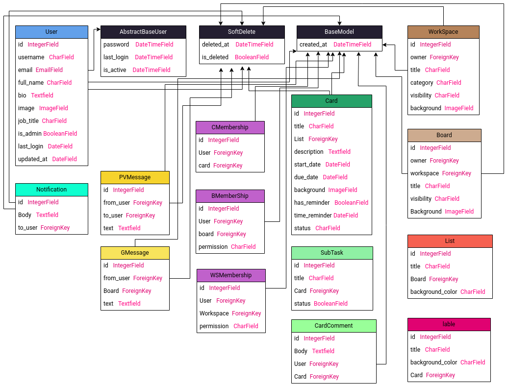

# TeemTask-RM

TeamTask is a web-based planning application built with Django framework and django rest framework. It provides users with the ability to create workspaces and boards where they can organize tasks in a Kanban-style manner. Users can create, update, and assign tasks to specific users. One of the key features of this application is the ability for users to engage in group or private chats within each board, facilitating collaboration and communication.

## Table of Contents

- [Getting Started](#getting-started)
  - [ERD](#ERD)
  - [Prerequisites](#prerequisites)
  - [Installation](#installation)
- [Usage](#usage)
- [Contributing](#contributing)
- [License](#license)
- [Team](#Team)
- [Acknowledgements](#acknowledgements)

## Getting Started

This section should provide instructions on how to get started with the project. It should include any prerequisites that need to be installed, as well as instructions on how to install the project.

### ERD

  

### Prerequisites

Before installing Resonegram, make sure you have the following requirements:

    Python 3.8.x or higher
    Django 3.2.x or higher
    Django Rest Framework 
    Other dependencies listed in the requirements.txt file

### Installation

To install Resonegram, follow these steps:

    1. Clone the repository to your local machine
    2. Create a virtual environment and activate it
    3. Install the dependencies using pip
    4. Run the migrations using python manage.py migrate
    5. Create a superuser account using python manage.py createsuperuser
    6. Run the development server using python manage.py runserver

## Usage

Once you have installed Resonegram, you can access it through your web browser at http://localhost:8000. From there, you can       sign up for an account, create posts, leave comments, like posts, and chat with other users.

## Contributing

If you would like to contribute to Resonegram, please read the CONTRIBUTING.md file for guidelines on how to do so.

## License

This project is licensed under the MIT License - see the LICENSE file for details.

## Team

- Mahsa Rahimi ([GitHub Profile](https://github.com/MahsaRah99))
- Mohamad Goodarzi ([GitHub Profile](https://github.com/mrgdeveloper1401))
- Mojtaba Anbahoun ([GitHub Profile](https://github.com/Mojtaba-anbahoun))
- Mahdi Hassanpour ([GitHub Profile](https://github.com/Mahdi-Hassanpour78))
- Ramin Eslami ([GitHub Profile](https://github.com/ResoneAt))

## Acknowledgements

We would like to thank the following individuals and organizations for their contributions to Resonegram:
    
    Django
    Django Restframwork
    Google
    GitHub
    SepehrBazyar
    mongard
    
